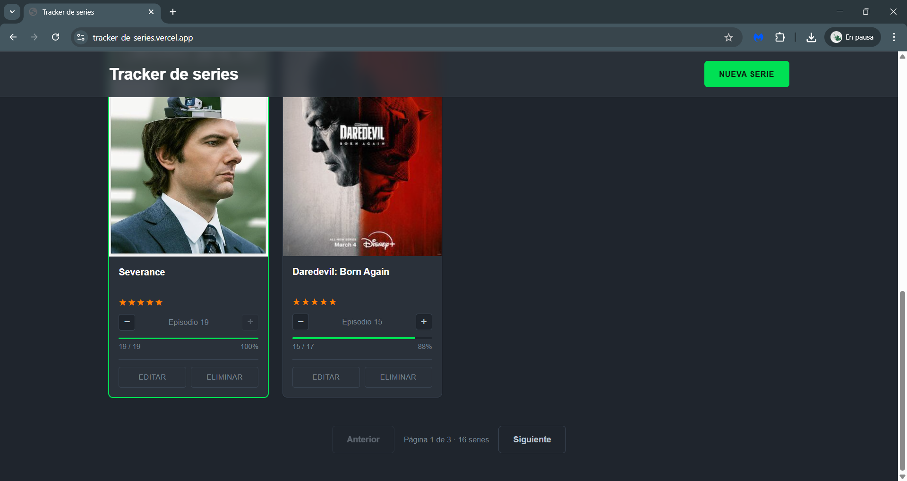

# Tracker de series — Backend

Sistemas y tecnologías web - S40
> Marco Carbajal (23025)

API REST en Go para el tracker de series. Expone endpoints para CRUD de series, ratings y subida de imágenes.

Frontend del proyecto: https://github.com/marcocarbajalb/proyecto1_web_frontend

## Stack

- Go 1.25
- SQLite (vía `modernc.org/sqlite`)
- `net/http` de la librería estándar

## Correr localmente

```bash
git clone https://github.com/marcocarbajalb/proyecto1_web_backend
cd proyecto1_web_backend
go mod download
go run .
```

El servidor arranca en `http://localhost:8080`. La base de datos (`series.db`) y la carpeta `uploads/` se crean automáticamente al primer arranque.

## Estructura del proyecto

```
proyecto1_web_backend/
├── main.go             # entrypoint y configuración del router
├── go.mod
├── Dockerfile
├── fly.toml
├── internal/
│   ├── db/
│   │   ├── db.go       # conexión y migraciones
│   │   └── schema.sql  # definición de tablas
│   ├── models/
│   │   └── series.go   # structs y validación
│   ├── handlers/
│   │   ├── series.go   # endpoints CRUD de series
│   │   ├── ratings.go  # endpoints de ratings
│   │   ├── uploads.go  # subida y servido de imágenes
│   │   └── errors.go   # helpers para respuestas de error
│   └── middleware/
│       └── cors.go     # middleware de CORS
└── uploads/            # archivos subidos (está en .gitignore)
```

El paquete `internal/` contiene toda la lógica del servidor separada por responsabilidad. El `main.go` se encarga solo de conectar piezas: abre la base de datos, registra las rutas en el router y levanta el servidor.

### Variables de entorno

| Variable         | Default      | Descripción                                  |
|------------------|--------------|----------------------------------------------|
| `PORT`           | `8080`       | Puerto donde escucha el servidor             |
| `DB_PATH`        | `series.db`  | Ruta al archivo de SQLite                    |
| `UPLOADS_DIR`    | `uploads`    | Carpeta donde se guardan las imágenes        |
| `ALLOWED_ORIGIN` | `*`          | Origen permitido para CORS (dominio del frontend) |

## Endpoints

### Series

| Método | Ruta              | Descripción                                     |
|--------|-------------------|-------------------------------------------------|
| GET    | `/series`         | Listar series (soporta `?q=`, `?sort=`, `?order=`, `?page=`, `?limit=`) |
| GET    | `/series/{id}`    | Obtener una serie                               |
| POST   | `/series`         | Crear una serie                                 |
| PUT    | `/series/{id}`    | Actualizar una serie                            |
| DELETE | `/series/{id}`    | Eliminar una serie                              |

### Ratings

| Método | Ruta                      | Descripción                        |
|--------|---------------------------|------------------------------------|
| GET    | `/series/{id}/rating`     | Obtener el rating de una serie     |
| PUT    | `/series/{id}/rating`     | Asignar o actualizar rating (1–5)  |
| DELETE | `/series/{id}/rating`     | Quitar el rating                   |

### Imágenes

| Método | Ruta                      | Descripción                                   |
|--------|---------------------------|-----------------------------------------------|
| POST   | `/series/{id}/image`      | Subir imagen de portada (max 1 MB, jpg/png/webp) |
| GET    | `/uploads/{filename}`     | Servir imagen subida                          |

## CORS

CORS (Cross-Origin Resource Sharing) es un mecanismo del navegador que restringe las peticiones cuando el cliente y el servidor están en distintos orígenes, por ejemplo diferentes puertos o dominios. En este proyecto, como el frontend y el backend están separados, el navegador bloquea esas solicitudes por defecto.

Para permitir la comunicación, el backend agrega ciertos headers en la respuesta, como `Access-Control-Allow-Origin`, que le indican al navegador que la petición está autorizada. En desarrollo se permite cualquier origen para facilitar el trabajo local. En producción, el origen permitido se configura a través de la variable de entorno `ALLOWED_ORIGIN`, de forma que solo el frontend deployado puede hacer peticiones al backend.

Además, el servidor debe manejar algunas solicitudes previas que el navegador envía automáticamente para verificar si la petición está permitida, respondiendo de forma adecuada para que luego la solicitud principal se pueda completar.

## Challenges implementados

- Códigos HTTP correctos en toda la API (201, 204, 404, 400, 415, 413, 500)
- Validación server-side con respuestas JSON descriptivas
- Paginación con `?page=` y `?limit=`
- Búsqueda por nombre con `?q=`
- Ordenamiento con `?sort=` y `?order=`
- Sistema de ratings con tabla propia y endpoints REST
- Subida de imágenes con límite de 1 MB y validación de tipo

## Reflexión

Elegí Go principalmente porque quería entender mejor cómo funciona HTTP sin depender tanto de capas muy abstractas como en el laboratorio anterior. Con `net/http` sentí que tenía un buen balance, porque me da herramientas listas para usar, pero igual me deja ver claramente qué está pasando con cada request y cada response. Además, me gustó que la mayoría de cosas que necesitaba ya vienen en la librería estándar, así que no tuve que agregar muchas dependencias externas.

Sobre la base de datos, decidí quedarme con SQLite porque el proyecto no era tan grande y me facilitaba bastante el trabajo. No tenía que configurar nada extra ni levantar otro servicio. Sé que si el proyecto creciera y necesitara manejar muchas conexiones al mismo tiempo, probablemente tendría que cambiar a algo como PostgreSQL, pero para este caso funcionó bien y fue suficiente.

Algo que me pareció importante fue entender mejor cómo manejar las validaciones. Aprendí que no es solo validar en un lugar, sino hacerlo en varias capas. El cliente ayuda a que el usuario tenga una mejor experiencia, el backend revisa que los datos tengan sentido, y la base de datos termina de asegurar que todo esté correcto. Es como una forma de cubrir errores desde distintos lados.

En general, sí volvería a usar esta combinación. Me pareció práctica, fácil de mantener y no tan complicada de desplegar. Además, el rendimiento fue bastante bueno sin tener que optimizar demasiado.

## Screenshots

Vista principal de la aplicación:


Paginación y controles de navegación:

